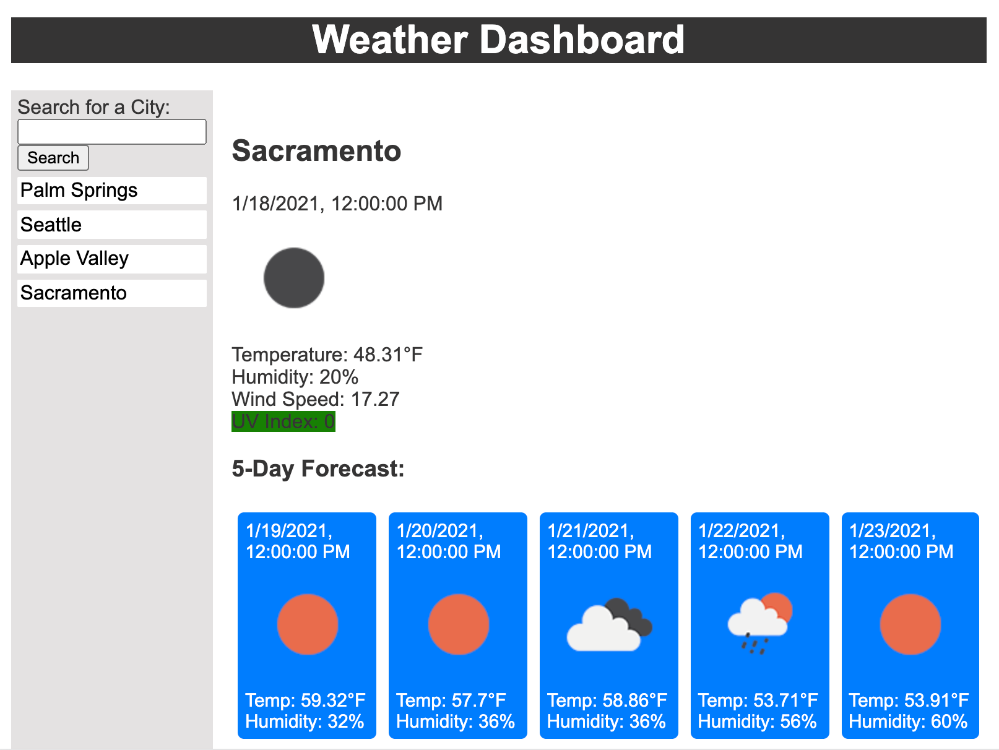
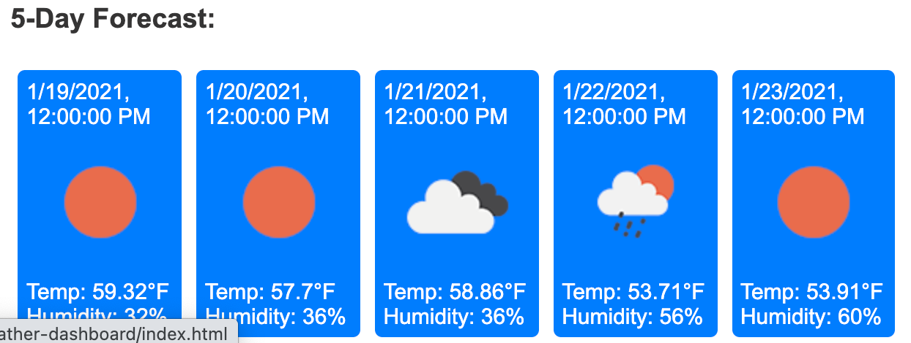
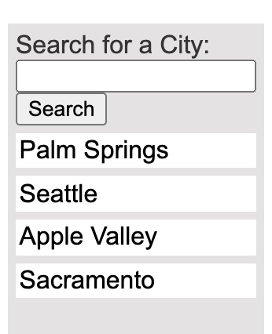
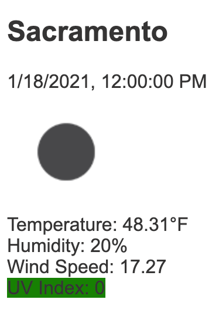

# weather-dashboard

## Purpose
Weather Dashboard is a weather forecast website that retrieves and displays current weather, wind speeds, humidity and UV levels for cities located in the U.S. It also provides the weather forecast for the following five days. 

 

 

 

## Built With
* HTML
* CSS
* JavaScript

## Website
https://sangyi05.github.io/weather-dashboard/
